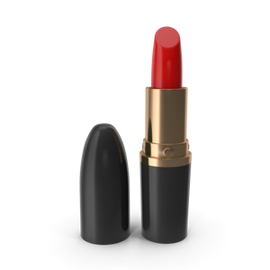

# **Milestone 3: CSS Layout – Advanced Styling for the E-Commerce Store**

## **Objective**
- Enhance the layout of the e-commerce store using **Flexbox** and **CSS Grid**.
- Introduce **classes** and **IDs** for reusable and specific styles.
- Implement responsive design with **media queries**.
- Focus on advanced layout techniques to create a polished, mobile-friendly site.

---

## **Project Overview**
This project completes the e-commerce store by refining its layout with Flexbox and Grid. It introduces responsiveness to ensure the website adapts to various screen sizes. Classes and IDs are used for better code structure and reusability.

---

## **Updated Project Code**

### **1. Updated `index.html`**
We add classes and IDs to enhance the maintainability of the code and facilitate specific styling.

```html
<!DOCTYPE html>
<html lang="en">
<head>
    <meta charset="UTF-8">
    <meta name="viewport" content="width=device-width, initial-scale=1.0">
    <title>E-Commerce Store</title>
    <link rel="stylesheet" href="style.css">
</head>
<body>
    <header class="site-header">
        
        <nav class="navbar">
            <a href="#" class="nav-link">Home</a>
            <a href="#" class="nav-link">Products</a>
            <a href="#" class="nav-link">Contact</a>
        </nav>
    </header>
    <main class="main-content">
        <section class="product-grid">
            <article class="product-card" id="product-1">
                <h2 class="product-title">Product 1</h2>
                
                <p class="product-description">A short description of Product 1.</p>
                <a href="#" class="product-button">Add to Cart</a>
            </article>
            <article class="product-card" id="product-2">
                <h2 class="product-title">Product 2</h2>
                
                <p class="product-description">A short description of Product 2.</p>
                <a href="#" class="product-button">Add to Cart</a>
            </article>
            <article class="product-card" id="product-3">
                <h2 class="product-title">Product 3</h2>
                
                <p class="product-description">A short description of Product 3.</p>
                <a href="#" class="product-button">Add to Cart</a>
            </article>
            <article class="product-card" id="product-4">
                <h2 class="product-title">Product 4</h2>
                
                <p class="product-description">A short description of Product 4.</p>
                <a href="#" class="product-button">Add to Cart</a>
            </article>
        </section>
    </main>
    <footer class="site-footer">
        <p>Contact us: <a href="mailto:info@ecommerce.com" class="footer-link">info@ecommerce.com</a></p>
        <p>&copy; 2025 E-Commerce Store</p>
    </footer>
</body>
</html>
```

---

### **2. Updated `style.css`**
The CSS file is expanded to include Flexbox, Grid, and responsive design.

```css
/* General styles */
body {
    font-family: Arial, sans-serif;
    line-height: 1.6;
    margin: 0;
    padding: 0;
    box-sizing: border-box;
}

img {
    max-width: 100%;
    height: auto;
}

/* Header styles */
.site-header {
    display: flex;
    justify-content: space-between;
    align-items: center;
    padding: 10px 20px;
    background-color: #333;
    color: white;
}

.logo {
    height: 50px;
}

.navbar {
    display: flex;
    gap: 15px;
}

.nav-link {
    color: white;
    text-decoration: none;
}

.nav-link:hover {
    text-decoration: underline;
}

/* Main content styles */
.main-content {
    padding: 20px;
}

.product-grid {
    display: grid;
    grid-template-columns: repeat(auto-fit, minmax(200px, 1fr));
    gap: 20px;
}

.product-card {
    border: 1px solid #ddd;
    border-radius: 5px;
    padding: 15px;
    text-align: center;
    background-color: #f9f9f9;
}

.product-title {
    font-size: 1.2rem;
    margin: 10px 0;
}

.product-description {
    font-size: 0.9rem;
    color: #555;
}

.product-button {
    display: inline-block;
    margin-top: 10px;
    padding: 10px 15px;
    background-color: #333;
    color: white;
    text-decoration: none;
    border-radius: 3px;
}

.product-button:hover {
    background-color: #555;
}

/* Footer styles */
.site-footer {
    text-align: center;
    padding: 10px;
    background-color: #333;
    color: white;
}

/* Responsive design */
@media (max-width: 768px) {
    .navbar {
        flex-direction: column;
        align-items: flex-start;
    }

    .product-card {
        padding: 10px;
    }
}
```

---

## **Core Concepts Demonstrated**
1. **Classes and IDs**:
   - Classes for reusable styling (`product-card`, `product-button`).
   - IDs for unique elements (`product-1`, `product-2`).

2. **Flexbox and Grid**:
   - Flexbox for navigation layout (`.navbar`).
   - CSS Grid for product listings (`.product-grid`).

3. **Responsive Design**:
   - Media queries for layout adaptation (`@media` rules).
   - Grid adjustments for smaller screens.

4. **Interactivity**:
   - Hover effects for buttons and links.

---

## **Expected Output**
A fully styled and responsive e-commerce store:
- Navigation bar adjusts for smaller screens.
- Product grid layout adapts to screen size.
- Interactive buttons and links enhance user experience.
